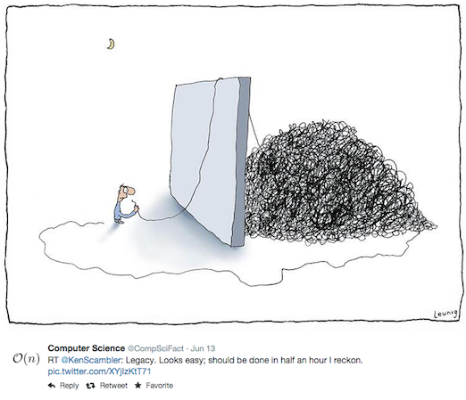

---?image=assets/bch-bg-small.png

### Better Code Hub (BCH) Education Pack
#### by
[SoftwareImprovementGroup.com](https://www.softwareimprovementgroup.com/power-tool-set/)

---

## Code Quality Education?

A hindrance or help? 

Generally speaking, both students and developers alike see code quality as something that gets in the way of their work. On the other hand, web pioneers like Marc Andreessen believe that writing maintainable, future-proof code is of paramount importance to society.

+++

Nobody wants to be hindered by unforeseen technical conditions. 

---

## BCH Education Pack 

What's included

- Better Code Hub Pro for [GitHub Education](https://education.github.com/pack)
- Access to [training repositories](https://github.com/bettercodehubtraining)

What's not included ;-)

- O'Reilly [Code Quality video training](https://player.oreilly.com/videos/9781491950791)
- O'Reilly [Building Maintainable Software](https://shop.oreilly.com/product/0636920049159.do)
- PeopleCert Certification [QSD](http://comm.peoplecert.org/IBD/QSD)

+++

Better Code Hub checks your code base for compliance against 10 software engineering guidelines - and gives you immediate feedback on where to improve.

+++

it helps you to write better code... 

+++

... with a Definition of Done ✅

+++

Better Code Hub integrates developer feedback in GitHub

+++
Ten Guidelines for future-proof code

[Building Maintainable Software](https://shop.oreilly.com/product/0636920049159.do)

+++

### Why Better Code Hub ?

- Provides a Definition of Done for Code Quality 
- Zero-setup time
- Feedback within a couple of minutes
- Feedback on every push and pull request
- Supports [17 modern programming languages](https://bettercodehub.com/docs/configuration-manual#configuringprogramminglanguages)
- Prioritized list of refactoring candidates
- Real-time impact estimates
- Metric thresholds derived from industry benchmark data

---

## The Better Code Hub Education Pack 

How to qualify 

- Computer Science course 
- Software Engineering course
- Using GitHub Classroom

at University, Applied Sciences or Polytechnique

+++

## Participants

###### [Carnegie Mellon Silicon Valley](https://github.com/cmusv-fse) | U.S.A
###### [Colorado State University](https://github.com/csu2017sp314/)  | U.S.A
###### [Dakota State University](https://github.com/dsu-cs/)  | U.S.A
###### [Polytechnique Montréal](https://github.com/poly-log8371) | Canada
###### [University of Victoria](https://github.com/SENG330-17) | Canada
###### [University of Ottawa](https://github.com/AES-Outreach) | Canada
###### [Universidad Politécnica de Madrid](https://github.com/ETSISI-EMS) | Spain

+++

###### [University of Amsterdam](https://github.com/software-engineering-amsterdam) | Netherlands
###### [Delft University](https://github.com/software-engineering-methods) | Netherlands
###### [Hanze Hogeschool](https://github.com/hanzehogeschoolSICT) | Netherlands
###### [Zuyd University](https://github.com/ZuydUniversity) | Netherlands
###### [University of Amsterdam MinProg](https://github.com/minprog) | Netherlands
###### [Hogeschool van Amsterdam](https://github.com/hva-makeitwork) | Netherlands
###### [Haagse Hogeschool](https://github.com/gameoftrades) | Netherlands
###### [Radboud Universiteit](https://github.com/giphouse) | Netherlands

+++

###### [Athens University Economics Business](https://github.com/dmst-sweng) | Greece
###### [Universidade de Porto](https://github.com/bch-feup-ooplab) | Portugal
###### [Lodz University of Technology](https://github.com/lodz-university-of-technology-masi) | Poland
###### [University of Gdansk](https://github.com/TestowanieJAVA2017-2018Gr2) | Poland
###### [University of Bonn](https://github.com/SmartDataAnalytics/) | Germany
###### [Faculty of Sciences, Department of Mathematics and Informatics, Novi Sad](https://github.com/SoftwareQualityLab) | Serbia
###### [Faculty of Engineering, Syddansk Universitet, Odense](https://github.com/sweat-tek) | Denmark

+++

###### [École nationale supérieure d’électronique, informatique, télécommunications, mathématique et mécanique de Bordeaux](https://github.com/EnseirbTelecom) | France

+++
## Quotes

######  [Education community post](https://education.github.community/t/a-proposed-add-on-for-code-quality-in-software-engineering-courses-using-github/9067/5) by [Fabio Petrillo](https://github.com/petrillo)
######  [Education community post](https://education.github.community/t/a-proposed-add-on-for-code-quality-in-software-engineering-courses-using-github/9067/6) by [Hakan Erdogmus](https://github.com/erdogmush)
###### [Gamification in Action](https://raw.githubusercontent.com/BetterCodeHubTraining/Edu-Pack/master/assets/studentcomment.jpg), [Scoreboard tweet](https://twitter.com/neilernst/status/940721095434313728) by [Neil Ernst](https://github.com/neilernst)
###### [Using BCH (in Dutch)](https://www.bartbarnard.nl/blog/?p=811) by [Bart Barnard](https://github.com/bart314) 

+++

## Other Community Offerings

- [Open Source Spring Cleaning](https://opensourcespringcleaning.github.io/)
- [Support for Hackathons](https://dev.to/jstvssr/how-a-hackathon-appreciates-quality-code)

---
## About SIG
[Software Improvement Group](https://sig.eu) 

- IT management advisory and measurement
- Code Quality Assurance
- Passionate about Getting Software Right
- Creator of Better Code Hub

+++

## Apply now!

- <bettercodehub@sig.eu>
- Twitter: [@bettercodehub](https://twitter.com/bettercodehub)

✨Thank you!✨

