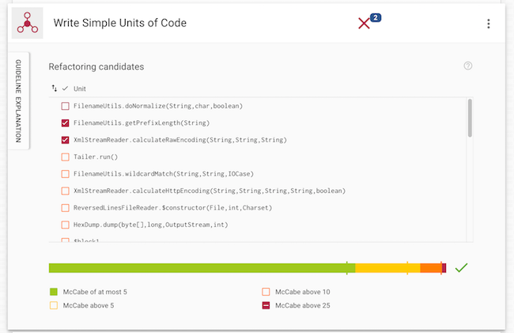

---?image=assets/bch-bg.png

### Introducing
## Better Code Hub - Education Pack
#### by Software Improvement Group SIG

---

## Teaching Code Quality?

A hinder of a help? 

Generally students and developers alike think that paying attention to Code Quality hinders them. While writing maintainable and thus future-proof code is of paramount importance to society 
(ref Marc Andreessen).

+++

Nobody wants to be hindered by unforeseen technical conditions. 

---
<!-- 
.reveal section img {
  border: 0;
  box-shadow: none;
} 
-->  

## The BCH Education Pack 

What's included

- Free access to Better Code Hub (BCH) Pro for your students via [Student Developer Pack](https://education.github.com/pack)
- Access to training repositories
- Code Quality workshops
- Free copies of [Building Maintainable Software](https://shop.oreilly.com/product/0636920049159.do)
- Discount on the Quality Software Development professional qualification [QSD](http://comm.peoplecert.org/IBD/QSD)

+++

Better Code Hub checks your code base for compliance against 10 software engineering guidelines - and gives you immediate feedback on where to improve.

+++

it helps you to write better code... 

+++

... with a Definition of Done ✅

+++

Better Code Hub integrates developer feedback in GitHub

+++
Ten Guidelines for future-proof code

[Building Maintainable Software](https://shop.oreilly.com/product/0636920049159.do)

+++

### Why Better Code Hub ?

- Provides a Definition of Done for Code Quality 
- Zero-setup time
- Feedback within a couple of minutes
- Feedback on every push and pull request
- Supports 16 modern programming languages
- Prioritized list of refactoring candidates
- Real-time impact estimates
- Metric thresholds derived from industry benchmark data

---

## The BCH Education Back 

How to qualify 

- Computer Science class at University
- Using GitHub Classroom

+++

## Participants

[FEUP](https://github.com/bch-feup-ooplab) | Universidade de Porto | Portugal
[GIPHOUSE](https://github.com/giphouse) | Radboud Universiteit | Netherlands
[AUEB-DMST](https://github.com/dmst-sweng) | Athens University | Greece

+++

## Other Community Offerings

- [Open Source Spring Cleaning](https://opensourcespringcleaning.github.io/)
- [Support for Hackathons](https://dev.to/jstvssr/how-a-hackathon-appreciates-quality-code)

---
## About SIG
[Software Improvement Group](https://sig.eu) 

- IT management advisory and measurement
- Passionate about Getting Software Right
- Creator of Better Code Hub

+++

## Get in Touch

- <bettercodehub@sig.eu>
- Twitter: [@sig_eu](https://twitter.com/sig_eu) or [@bettercodehub](https://twitter.com/bettercodehub)

✨Thanks for your time!✨

