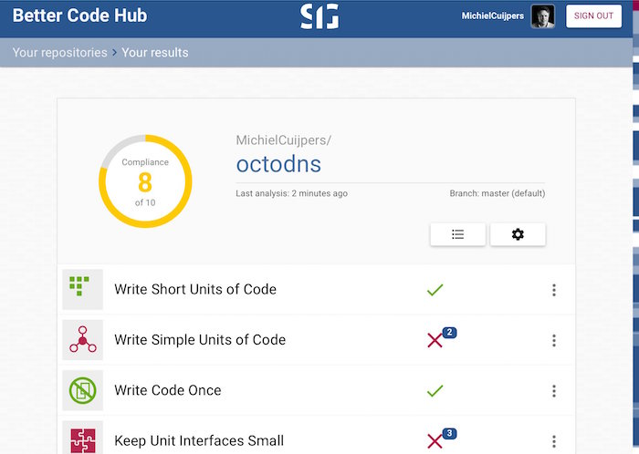

---?image=assets/bch-bg.png

### Introducing
## Better Code Hub Education Pack
#### by Software Improvement Group (SIG)

---

## Code Quality Education?

A hindrance or help? 

Generally speaking, both students and developers alike see code quality as something that gets in the way of their work. On the other hand, web pioneers like Marc Andreessen believe that writing maintainable, future-proof code is of paramount importance to society.

+++

Nobody wants to be hindered by unforeseen technical conditions. 

---
<!-- 
.reveal section img {
  border: 0;
  box-shadow: none;
} 
-->  

## The Better Code Hub Education Pack 

What's included

- Free access to Better Code Hub Pro for your course with [Student Developer Pack](https://education.github.com/pack)
- Access to [training repositories](https://github.com/bettercodehubtraining)
- Code Quality guest lecture (remote)
- Free copies of [Building Maintainable Software](https://shop.oreilly.com/product/0636920049159.do)
- Discount on the Quality Software Development professional qualification [QSD](http://comm.peoplecert.org/IBD/QSD)

+++

Better Code Hub checks your code base for compliance against 10 software engineering guidelines - and gives you immediate feedback on where to improve.

+++

it helps you to write better code... 

+++

... with a Definition of Done ✅

+++

Better Code Hub integrates developer feedback in GitHub

+++
Ten Guidelines for future-proof code

[Building Maintainable Software](https://shop.oreilly.com/product/0636920049159.do)

+++

### Why Better Code Hub ?

- Provides a Definition of Done for Code Quality 
- Zero-setup time
- Feedback within a couple of minutes
- Feedback on every push and pull request
- Supports 16 modern programming languages
- Prioritized list of refactoring candidates
- Real-time impact estimates
- Metric thresholds derived from industry benchmark data

---

## The Better Code Hub Education Pack 

How to qualify 

- Computer Science course 
- Software Engineering course
- Using GitHub Classroom

at University, Applied Sciences or Polytechnique

+++

## Participants

###### [CMUSV-fse](https://github.com/cmusv-fse) | Carnegie Mellon S.V. | U.S.A
###### [CSU-CS-314](https://github.com/csu2017sp314/) | Colorado State University | U.S.A.
###### [POLYMTLOG](https://github.com/poly-log8371) | Polytechnique Montréal | Canada
###### [SENG330](https://github.com/SENG330-17) | University of Victoria | Canada
###### [AUEB-DMST](https://github.com/dmst-sweng) | Athens University | Greece
###### [FEUP](https://github.com/bch-feup-ooplab) | Universidade de Porto | Portugal
###### [GIPHOUSE](https://github.com/giphouse) | Radboud Universiteit | Netherlands
###### [UVA-SE](https://github.com/software-engineering-amsterdam) | University of Amsterdam | Netherlands

+++

###### [TUD-SEM](https://github.com/software-engineering-methods) | Delft University | Netherlands
###### [Hanze](https://github.com/hanzehogeschoolSICT) | Hanze Hogeschool | Netherlands
###### [Zuyd](https://github.com/ZuydUniversity) | Zuyd University Heerlen | Netherlands
###### [MinorProg](https://github.com/minprog) | University Amsterdam | Netherlands
###### [MAKEITWORK](https://github.com/hva-makeitwork) | Hogeschool van Amsterdam | Netherlands

+++
## Quotes

######  [Education community post](https://education.github.community/t/a-proposed-add-on-for-code-quality-in-software-engineering-courses-using-github/9067/5) by [Fabio Petrillo](https://github.com/petrillo)
######  [Education community post](https://education.github.community/t/a-proposed-add-on-for-code-quality-in-software-engineering-courses-using-github/9067/6) by [Hakan Erdogmus](https://github.com/erdogmush)
###### [Gamification in Action](https://raw.githubusercontent.com/BetterCodeHubTraining/Edu-Pack/master/assets/studentcomment.jpg), [Scoreboard tweet](https://twitter.com/neilernst/status/940721095434313728) by [Neil Ernst](https://github.com/neilernst)
###### [Using BCH (in Dutch)](https://www.bartbarnard.nl/blog/?p=811) by [Bart Barnard](https://github.com/bart314) 

+++

## Other Community Offerings

- [Open Source Spring Cleaning](https://opensourcespringcleaning.github.io/)
- [Support for Hackathons](https://dev.to/jstvssr/how-a-hackathon-appreciates-quality-code)

---
## About SIG
[Software Improvement Group](https://sig.eu) 

- IT management advisory and measurement
- Passionate about Getting Software Right
- Creator of Better Code Hub

+++

## Get in Touch

- <bettercodehub@sig.eu>
- Twitter: [@sig_eu](https://twitter.com/sig_eu) or [@bettercodehub](https://twitter.com/bettercodehub)

✨Thanks for your time!✨

